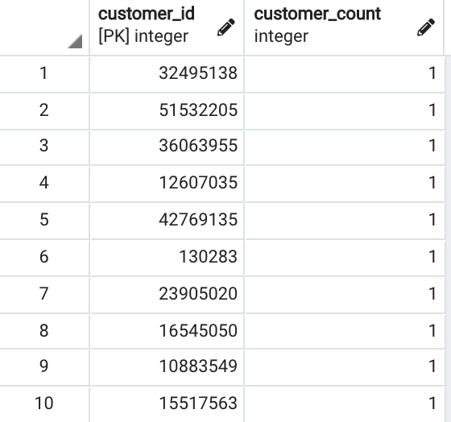
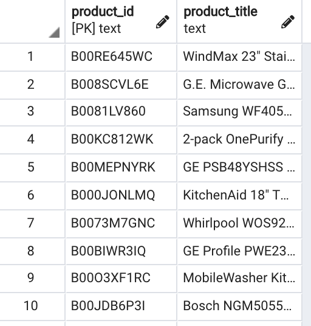
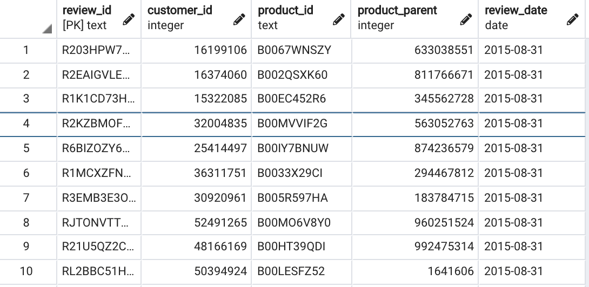
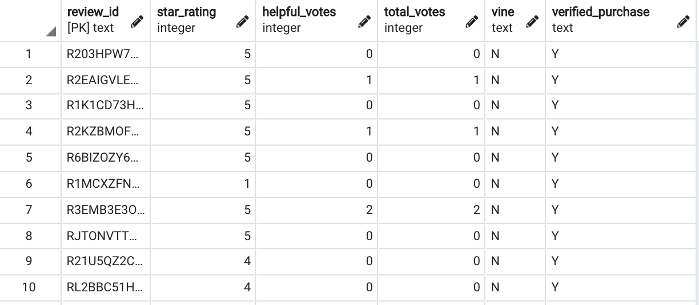
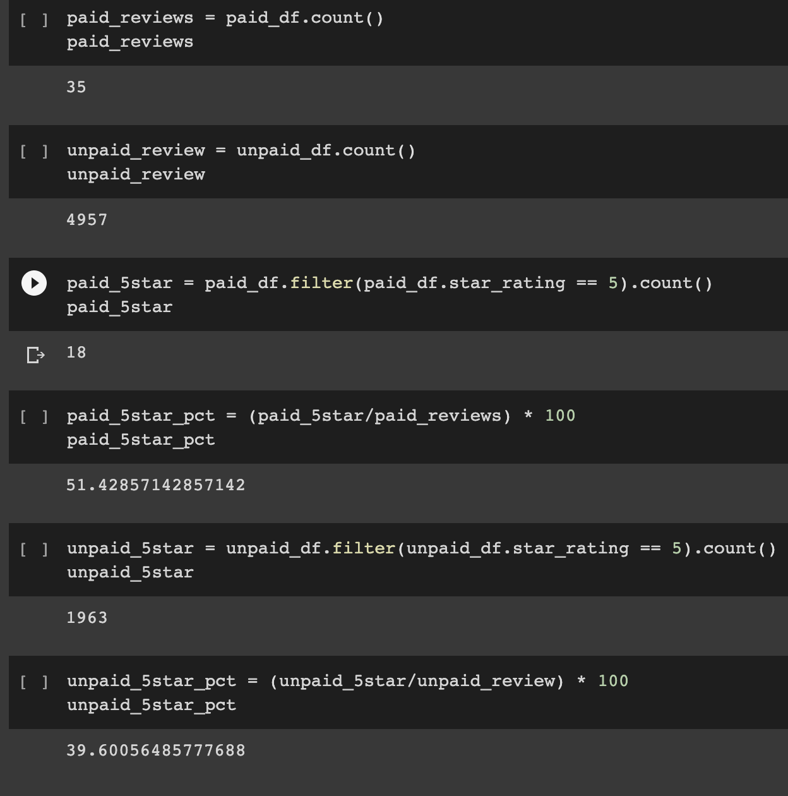

# amazon_vine_analysis

## Project Overview

Using PySpark and Amazon Web Servies, we looked review data for Major Appliances. We connected our Amazon database to pgAdmin and using postgres created a number of tables to break down the review data in a digestible way. We also analyzed the review data to look at the Amazon Vine program to look at how Vine members reviewed the items compared to non Vine reviewers.

## Resources

Data Source: [Amazon Reviews](https://s3.amazonaws.com/amazon-reviews-pds/tsv/index.txt) [Major Appliance Review Data](https://s3.amazonaws.com/amazon-reviews-pds/tsv/amazon_reviews_us_Major_Appliances_v1_00.tsv.gz)

Software Used: AWS, pgAdmin4, postgreSQL 12.8, Google Colab Notebook

## Results

* We filtered the original data set down and selected only the columns that we wanted, which are displayed in the above tables.  

    * 
    * 
    * 
    *   

* In addition to creating the tables, we filtered the data to look at the total number of paid reviews, unpaid reviews, and the percentage of those reviews that were 5-stars.
    * 
* We can see that there were 35 paid reviews, of which 18 were 5 stars. This equates to 51.4% of paid reviews being 5 stars
* Of the 4,957 unpaid reviews, 1,963 were 5 stars. This is only 39.6% of the total unpaid reviews.

## Summary

It appears as though the Vine reviewers, those who were a part of the Vine Program, were more likely to review an item as 5-stars than those non-Vine reviewers. A little more than half of Vine program participants gave items a 5-star review, compared to less than 40% of non-Vine participants. We could also look at the percentage of reviews that were deemed "Helpful" and see if there is a difference between Vine and non-Vine reviewers in how helpful their review was.